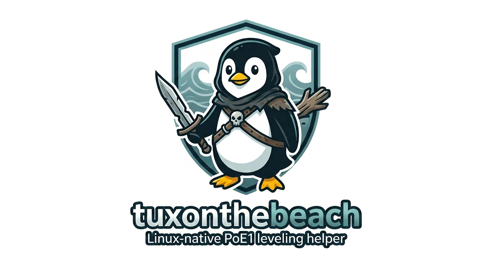

# TuxontheBeach

<p align="center">
  
</p>

Linux overlay for Path of Exile leveling — tracks your progress automatically.

GTK4 + `wlr-layer-shell` build. Native Wayland, no compositor hacks.

## Installation

```bash
# Arch / CachyOS
sudo pacman -S gtk4-layer-shell python-gobject
pip install watchdog --break-system-packages

# Clone
git clone https://github.com/sandrigo/tuxonthebeach.git
cd tuxonthebeach

# Run
python3 tuxonthebeach_gtk.py
```

Compatible compositors: **niri, sway, Hyprland, river, KDE Plasma**. GNOME/Mutter isn't supported (no layer-shell).

## Usage

1. **Import Route**: Click ⬇ → paste JSON from [exile-leveling.io](https://heartofphos.github.io/exile-leveling/)
2. **Auto-Track**: Automatically follows your zone changes via PoE's `Client.txt`
3. **Navigate**: Use ◄ ► buttons, or click on the step counter to **jump** to any step

### Quick controls

| Button | Action |
|---|---|
| ⬇ | Import route from clipboard |
| ⚙ | Settings (character, build, opacity, font, log path) |
| ? | About |
| ✕ | Close (with confirmation) |
| ◄ ► | Previous / next step |
| 💎 | Toggle gem overlay |
| **X/Y** counter | Click to jump to a specific step |
| ▴ / ▾ (blue, bottom-right outer) | Hide / show titlebar (acts as a window-lock — see below) |
| ▢ (gold, bottom-right outer) | Drag-resize handle |

You can also drag the window via the **header** OR the **zone label** (handy when the titlebar is hidden).

## Settings (⚙ button)

- **Character name** — switches the active progress profile. Each character gets its own `progress_<name>.json`, so multiple alts can be tracked independently. Empty = shared default profile.
- **Build** — display string shown in the titlebar (e.g. *"Witch · SRS"*). Pure cosmetic.
- **Client.txt path** — manual override. Auto-discovery covers `~/.steam`, `~/.local/share/Steam`, Proton prefixes, and external libraries under `/mnt/*`, `/run/media/*`, `/media/*`. *Tip: in Steam, right-click Path of Exile → Manage → Browse local files → `logs/Client.txt`.*
- **Opacity** — overlay transparency slider (30–100%), live preview.
- **Step font** — maximum font size (8–20pt) for the step text. The text auto-shrinks below this when content is long, so everything stays visible without scrollbars.

All settings persist to `~/.config/tuxonthebeach/config.json`.

## Features

- 🌊 **Native Wayland** — uses `wlr-layer-shell` for proper always-on-top behaviour (no XWayland hacks, no KDE-only window rules)
- 🗺️ **Auto zone detection** via `Client.txt` (with smart skip — won't jump to Act 6 Mud Flats when you re-enter Act 1)
- 💎 **Inline gem overlay** showing the next 3 gems, with smooth slide animation
- 🎯 **Dynamic font fitting** — long steps auto-shrink to fit the window, no scrolling
- 🔒 **Hide-titlebar = lock** — collapses the header AND keeps the window perfectly anchored at the bottom edge, so a content/font change can't shift it out from under the cursor
- 👥 **Multi-character profiles** — name your character in settings, get a dedicated progress file
- 💾 **Position, size, opacity, font, gem toggle, titlebar state — all persisted** between sessions
- 🎨 **Adjustable opacity** with live preview
- ⚡ **Fast & minimal UI** with smooth animations

## Compositor support

| Compositor | Supported |
|---|---|
| niri | ✅ |
| sway | ✅ |
| Hyprland | ✅ |
| river | ✅ |
| KDE Plasma (Wayland) | ✅ |
| GNOME / Mutter | ❌ (no layer-shell) |
| X11 anything | ❌ |

## Files

All files must live in the same directory:

- `tuxonthebeach_gtk.py` — the overlay
- `update_data.py` — pulls latest `areas.json` / `gems.json` / `quests.json` from upstream
- `gems.json`
- `areas.json`
- `quests.json`

Data sourced from [HeartofPhos/exile-leveling](https://github.com/HeartofPhos/exile-leveling).

### Updating game data (new PoE patch)

When a new league drops (e.g. 3.27 → 3.28), refresh the JSONs with:

```bash
python3 update_data.py
```

The script checks each file's git blob SHA against upstream, downloads only what changed, and prints the latest commit (date + message) so you see which patch the data targets. State is kept in `.exile_data_versions.json`. Pass `--force` to re-download regardless. Set `GITHUB_TOKEN` in your env if you hit GitHub's anonymous rate limit.

## Notes

- Suppresses GTK4 Vulkan resize warnings by setting `GSK_RENDERER=gl` automatically — override with your own env var if needed.
- Auto-relinks `libgtk4-layer-shell.so` via `LD_PRELOAD` on first launch (a quirk of layer-shell + Python imports).

## Credits

Inspired by:
- [Exile-Leveling](https://heartofphos.github.io/exile-leveling/) by HeartofPhos
- [Exile-UI](https://github.com/Lailloken/Exile-UI) by Lailloken

## License

MIT
